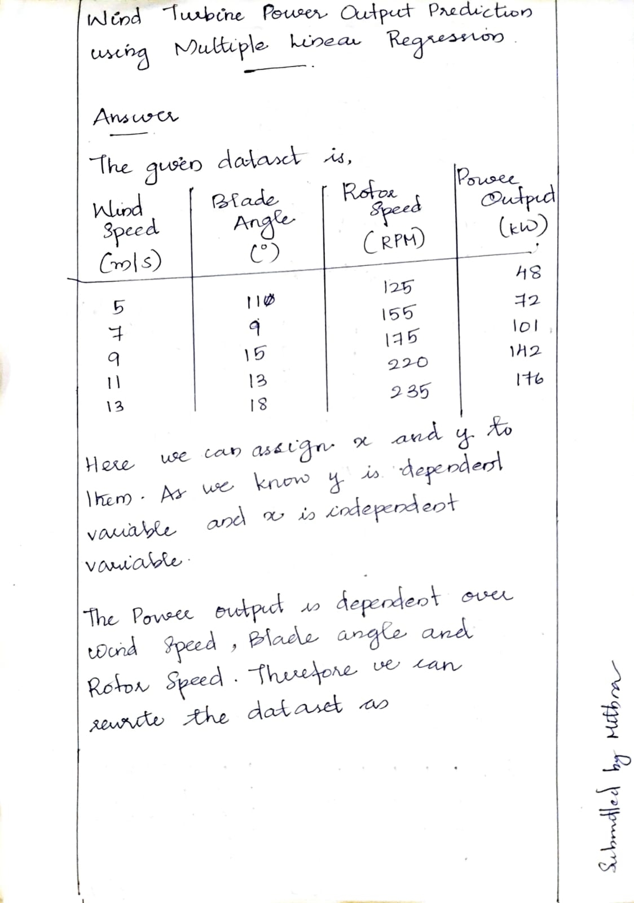
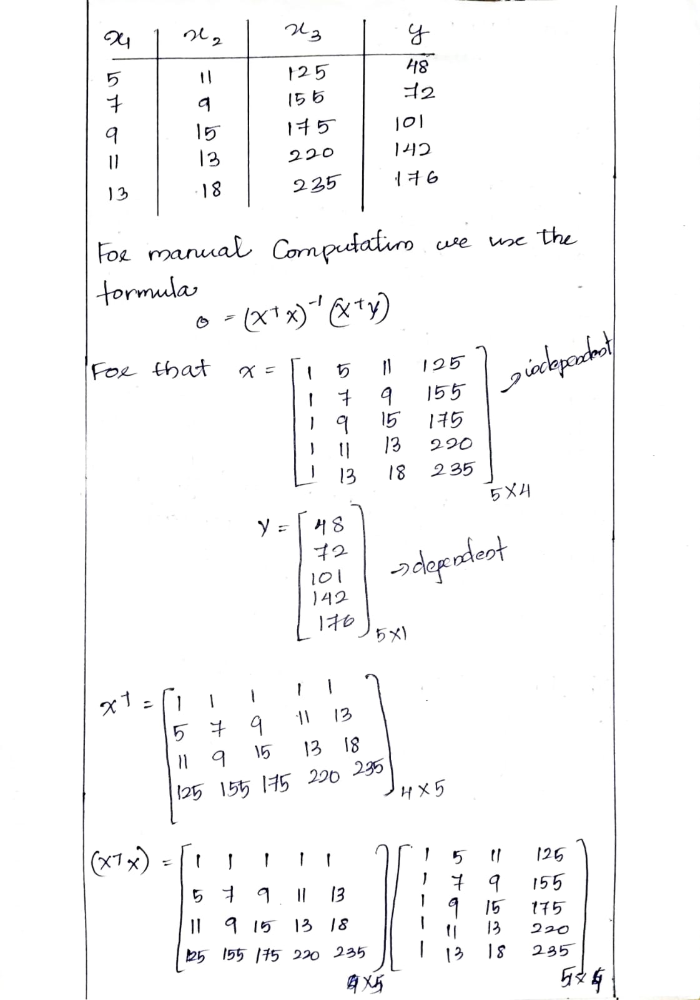
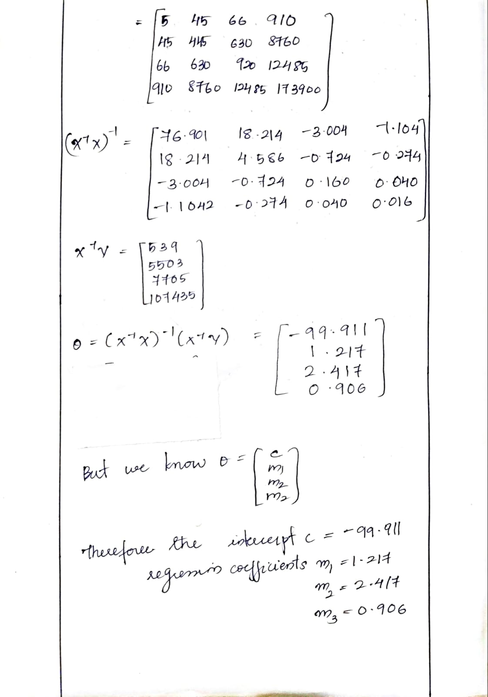
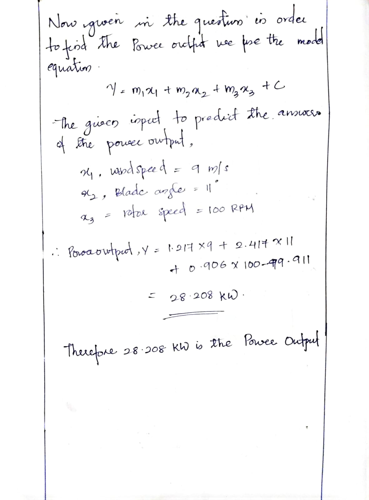
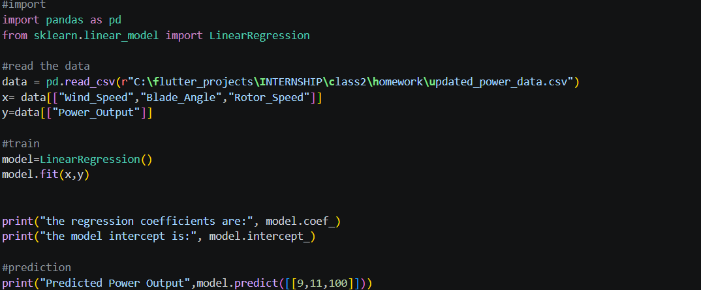
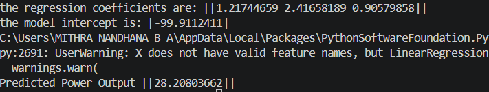

# Assignment 2- Multiple- Linear-Regression
Assignment 2 about Multiple Linear Regression submitted by Mithra Nandhana B A. 

## Problem Statement
A wind energy company wants to predict the Power Output (kW) of a wind turbine
using the following parameters:
• Wind Speed (m/s)
• Blade Angle (◦)
• Rotor Speed (RPM)

## Answer
Below using the normal equation and the model equation
1. The regression coefficients 
2. Prediction of Power output is done manually

*check out the whole pdf:* `assignment2-Multiple-Linear-Regression/numericals/numerical.pdf/`

And, implementation of the same is done using python. The code is saved in the `assignment2-Multiple-Linear-Regression/output/` along with the csv file containing the data and the code.

The code and the output along with graph are given below.

## *Code*

## *Output*

## Final Answer
The Regression Coefficients are 1.21744659 ,2.41658189 ,0.90579858
And the Predicted Power Output is 28.20803662

# What I Learned
By this assignment and class, I learned:
1. Multiple Linear Regression Model
2. Working on matrix

:D
